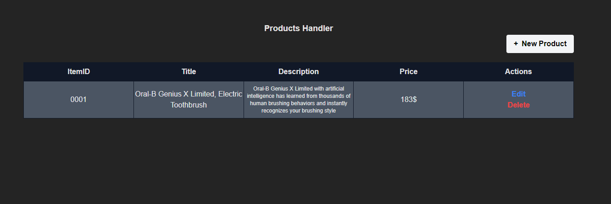

# React JS Assignment 

This project is just a simple test of React JS to see the ability of applicants to understand the language and the applicability of some types of properties

### Properties
- React JS Application
- Tailwind CSS
- Vite environment

### About Application
The application contain a Table list of products, Have "title,description,cost" and new product button, the user can edit and add new product to the list




# Requirement  

You need to clone the repo and edit the application to handle the API of products to can SAVE,EDIT,DELETE,GET products from the API

- Handle Product List, and render the products list in the table
- Make new form to add new product with the POST method
- User Can edit the product with product ID "NOT REQUIRED"
- User can delete the product with the product ID


# API Details

This details about the API that can help you


## End-point: Get List
**Get List product**

You can Get the list of products GET method that response

**data**

- ID
- title
- description
- cost
- userName
    

**info**

- total products
- pages
- nextPage
- previousPage
### Method: GET
>```
>https://ec2-35-180-148-54.eu-west-3.compute.amazonaws.com/api/product
>```
### Response: 200
```json
{
    "data": [
        {
            "ID": 1,
            "title": "Product title",
            "description": "Product description",
            "cost": 1.5,
            "userName": "Altomy"
        }
    ],
    "info": {
        "total": 1,
        "pages": 0,
        "nextPage": 0,
        "previousPage": 0
    }
}
```


⁃ ⁃ ⁃ ⁃ ⁃ ⁃ ⁃ ⁃ ⁃ ⁃ ⁃ ⁃ ⁃ ⁃ ⁃ ⁃ ⁃ ⁃ ⁃ ⁃ ⁃ ⁃ ⁃ ⁃ ⁃ ⁃ ⁃ ⁃ ⁃ ⁃ ⁃ ⁃ ⁃ ⁃ ⁃ ⁃ ⁃ ⁃ ⁃ ⁃ ⁃ ⁃ ⁃ ⁃ ⁃ ⁃ ⁃


## End-point: Store
You can store product with POST
### Method: POST
>```
>https://ec2-35-180-148-54.eu-west-3.compute.amazonaws.com/api/product
>```
### Body (**raw**)

```json
{
    "title":"Product title",
    "description":"Product description",
    "cost":1.5,
    "userName":"Altomy"
}
```

### Response: 200
```json
{
    "ID": 1,
    "title": "Product title",
    "description": "Product description",
    "cost": 1.5,
    "userName": "Altomy"
}
```


⁃ ⁃ ⁃ ⁃ ⁃ ⁃ ⁃ ⁃ ⁃ ⁃ ⁃ ⁃ ⁃ ⁃ ⁃ ⁃ ⁃ ⁃ ⁃ ⁃ ⁃ ⁃ ⁃ ⁃ ⁃ ⁃ ⁃ ⁃ ⁃ ⁃ ⁃ ⁃ ⁃ ⁃ ⁃ ⁃ ⁃ ⁃ ⁃ ⁃ ⁃ ⁃ ⁃ ⁃ ⁃ ⁃ ⁃

## End-point: Update
You can update the product with PUT method
### Method: PUT
>```
>https://ec2-35-180-148-54.eu-west-3.compute.amazonaws.com/api/product
>```
### Body (**raw**)

```json
{
    "ID":2,
    "title":"New product title",
    "description":"New product description",
    "cost":4
}
```

### Response: 200
```json
{
    "ID": 2,
    "title": "New product title",
    "description": "New product description",
    "cost": 4,
    "userName": ""
}
```


⁃ ⁃ ⁃ ⁃ ⁃ ⁃ ⁃ ⁃ ⁃ ⁃ ⁃ ⁃ ⁃ ⁃ ⁃ ⁃ ⁃ ⁃ ⁃ ⁃ ⁃ ⁃ ⁃ ⁃ ⁃ ⁃ ⁃ ⁃ ⁃ ⁃ ⁃ ⁃ ⁃ ⁃ ⁃ ⁃ ⁃ ⁃ ⁃ ⁃ ⁃ ⁃ ⁃ ⁃ ⁃ ⁃ ⁃

## End-point: Delete
You can delete the product with ID and DELETE method
### Method: DELETE
>```
>https://ec2-35-180-148-54.eu-west-3.compute.amazonaws.com/api/product/3
>```
### Response: 200
```json
Deleted
```


⁃ ⁃ ⁃ ⁃ ⁃ ⁃ ⁃ ⁃ ⁃ ⁃ ⁃ ⁃ ⁃ ⁃ ⁃ ⁃ ⁃ ⁃ ⁃ ⁃ ⁃ ⁃ ⁃ ⁃ ⁃ ⁃ ⁃ ⁃ ⁃ ⁃ ⁃ ⁃ ⁃ ⁃ ⁃ ⁃ ⁃ ⁃ ⁃ ⁃ ⁃ ⁃ ⁃ ⁃ ⁃ ⁃ ⁃
_________________________________________________
